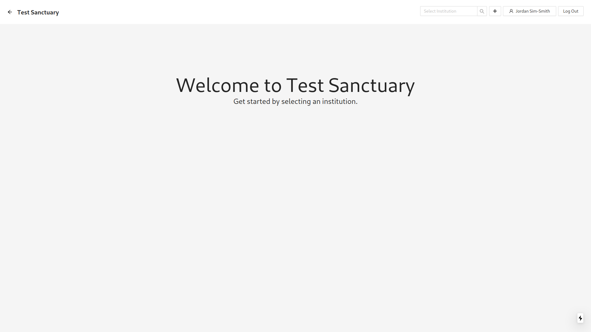
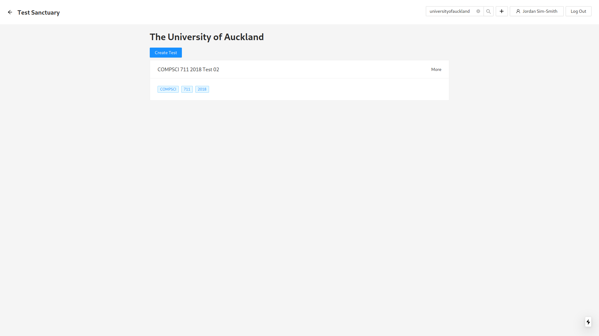
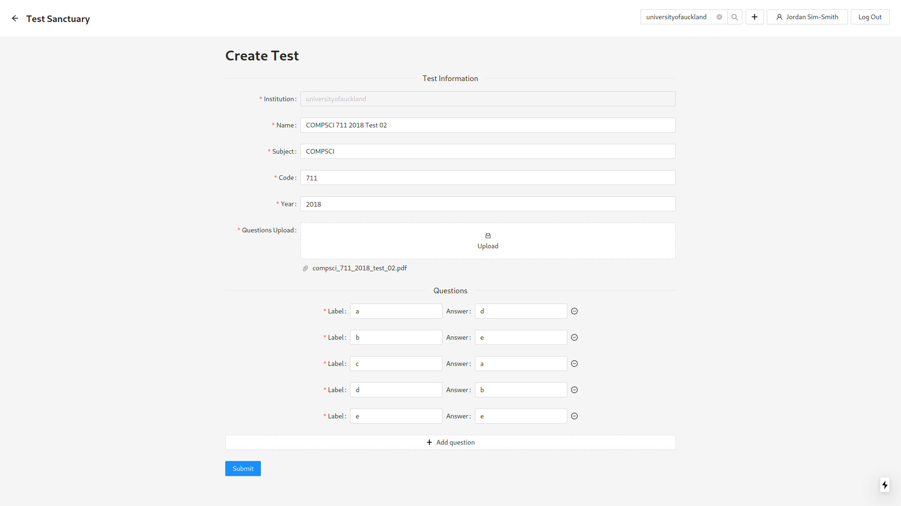
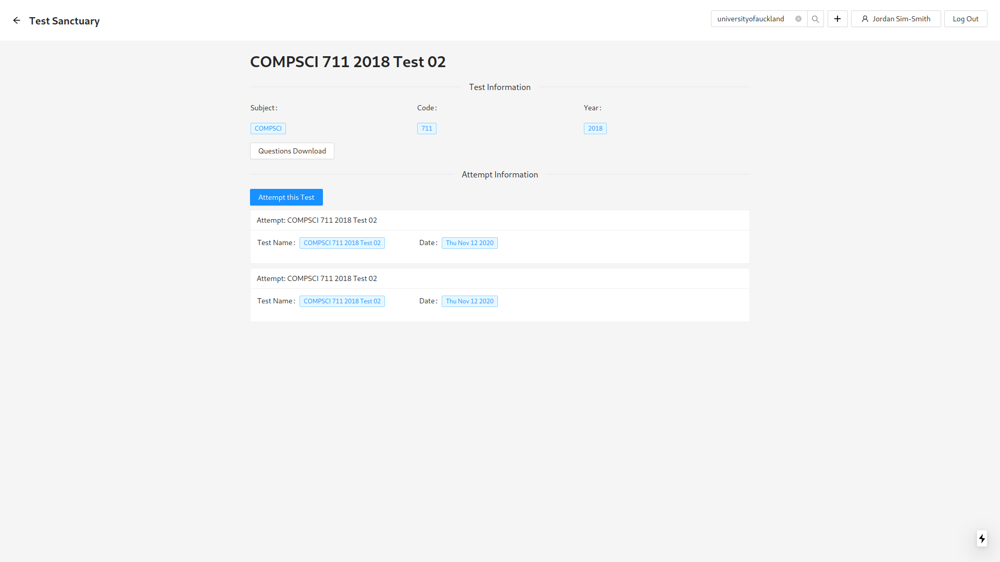
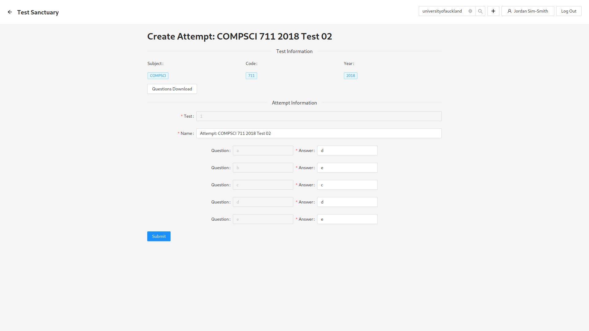
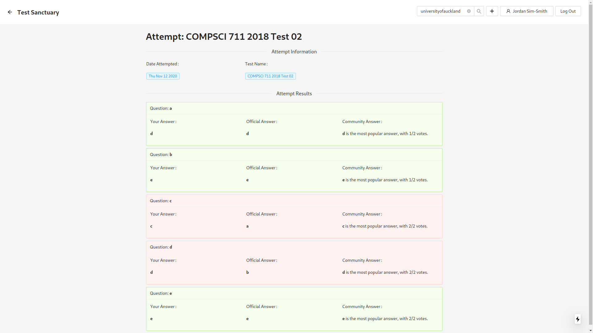
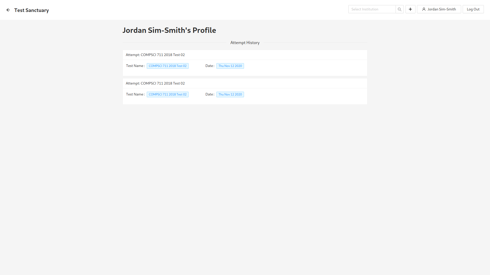

# Test Sanctuary

Test Sanctuary is a web application that facilitates collaboration on multi choice question tests.

## Features

- Users can login and logout using their email or SSO provider.
- Users can create new institutions (e.g. The University of Auckland).
- Users can create tests, involving test file uploads.
- Users can view tests for an institution.
- Users can attempt a test, providing answers.
- User's attempts are automatically marked against official answers if provided.
- Otherwise, user answers are compared against the most common community answer.
- Users can view their attempt history.

## Technologies

- Database: MariaDB
- Static Files: AWS S3
- Authentication: Auth0
- Server: Nest.js, GraphQL, Apollo Server, TypeORM
- Client: Next.js, Apollo Client, Ant Design
- Deployment: Kubernetes, Docker

## Screenshots

